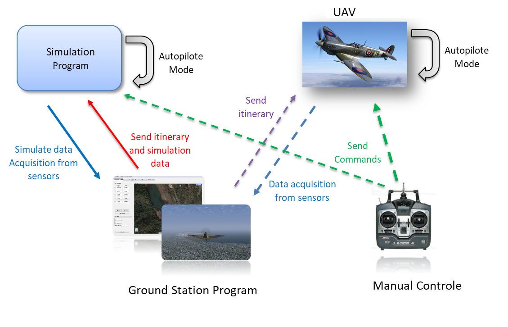
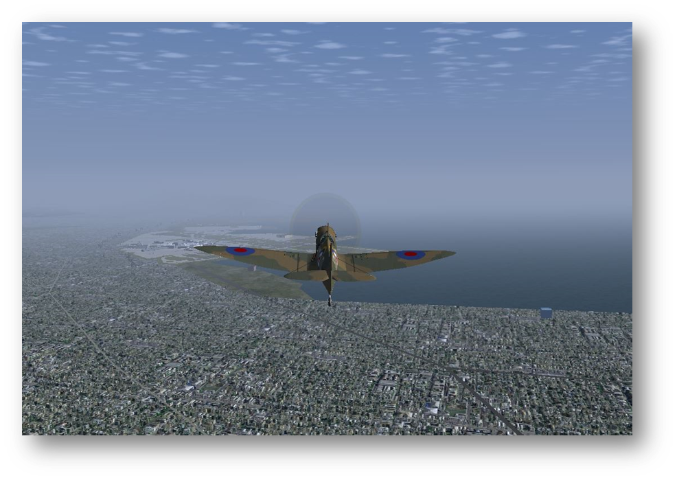
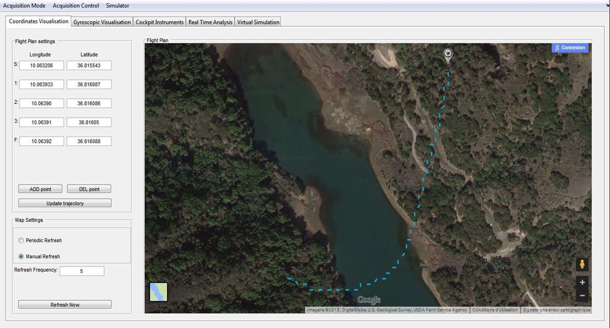
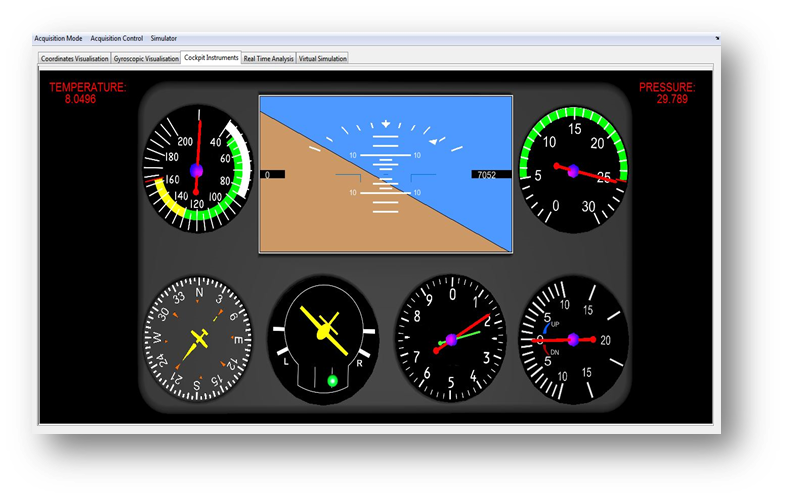
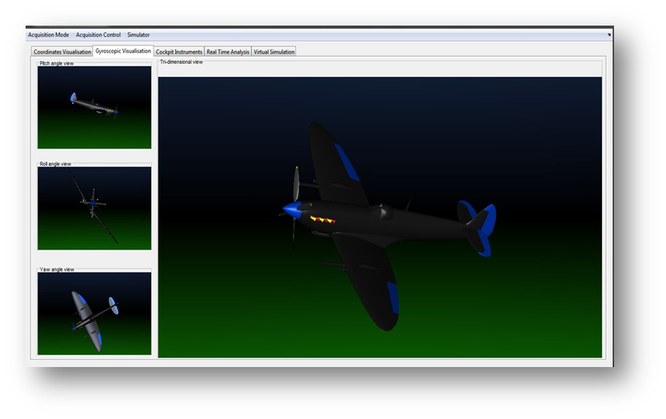
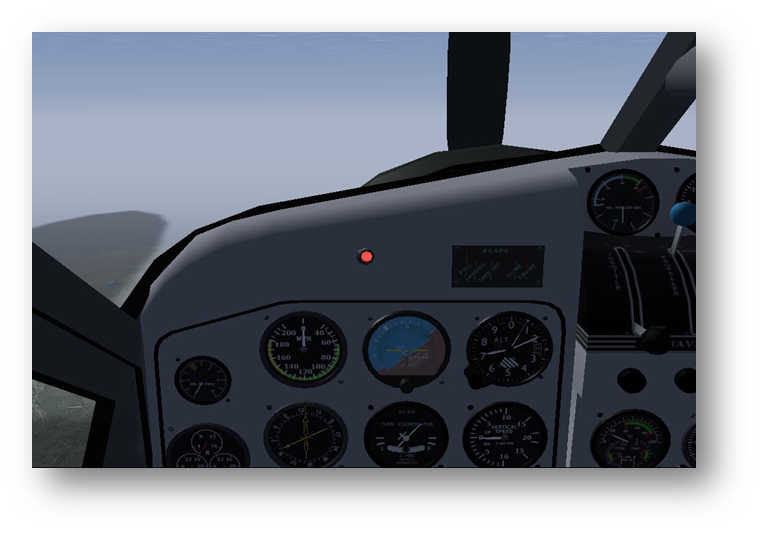
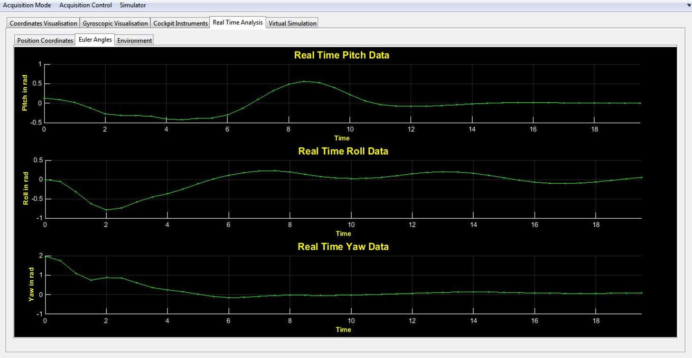
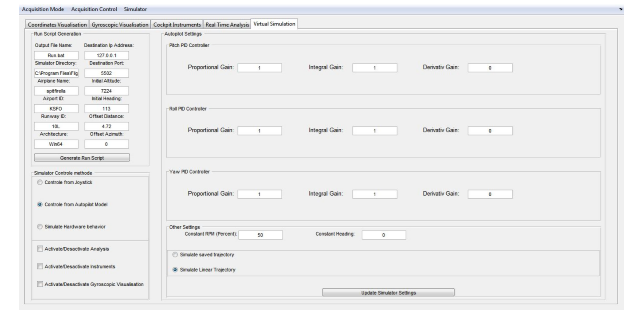

# Ground-station-and-simulator-for-Unmanned-aerial-vehicle
Developped by: tn.linkedin.com/in/Trifi

A matlab based ground station for aerial vehicle, The program allows:
 - Real time data acquisition, display and analyses of raw data from GPS, Gyroscope, magnetometer, altitude, temperature, pressure and speed      controller sensors.
 - Itinerary drawing and coordinates sending.
 - Simulink based simulator algorithm for offline testing.
 - Real time 3D display of the vehicle position in Flight Gear Simulator.
 - A PID algorithm tester for autopilot algorithmes.
 
# Global system overview:

Note that the source code and designing details of the UAV and manual controle unit are not being shared throught this repository, however more details about the hole system can be found in the following document:
https://github.com/TrifiAmanallah/Ground-station-and-simulator-for-Unmanned-aerial-vehicle/blob/master/Project_rapport.pdf

# Screen shots:

 

 

 

 
